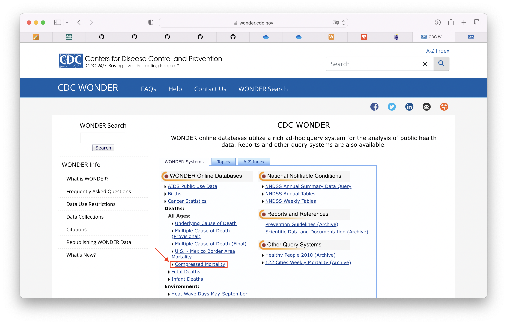
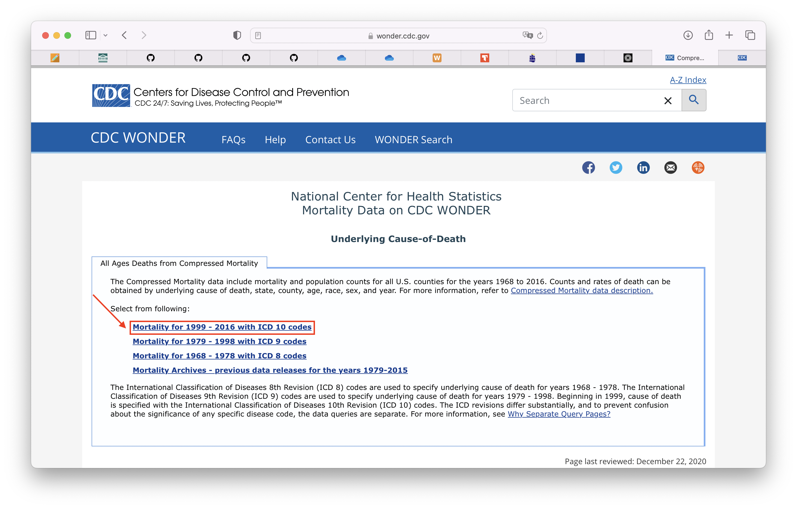
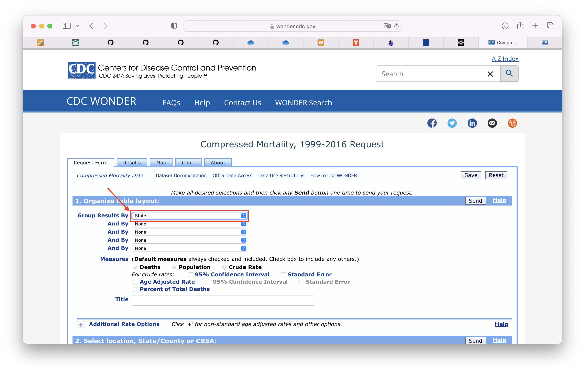
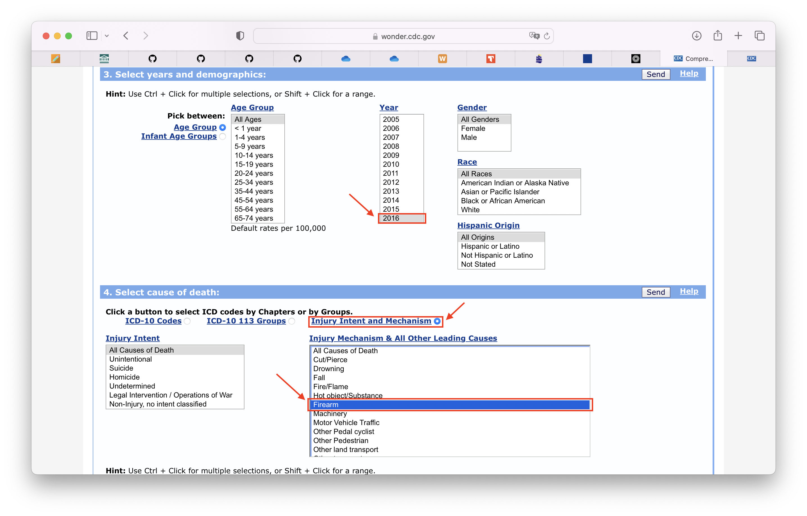
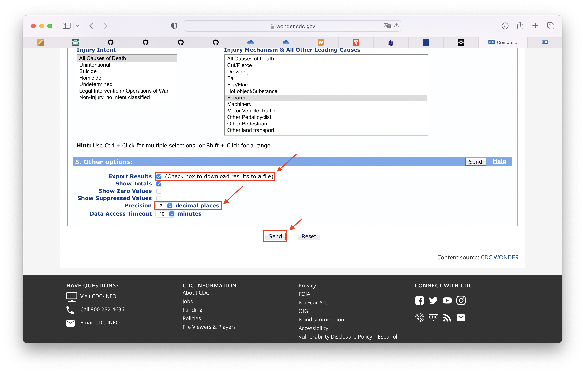
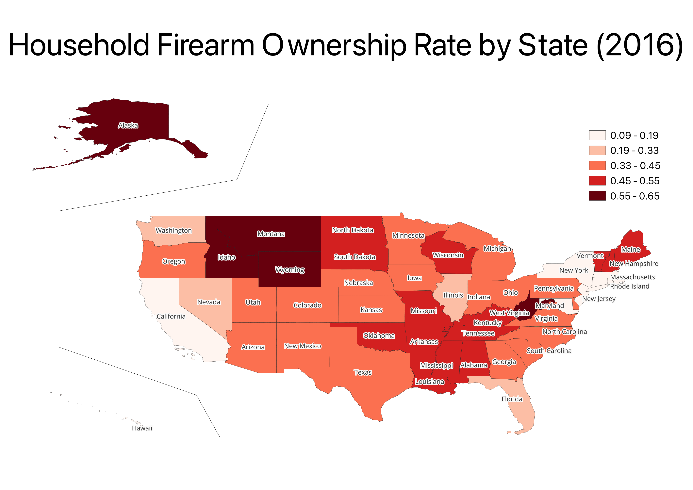

# Gun Ownership and Firearm Fatality in the U.S.

## Background

Gun violence has been a public concern in the U.S. In 2020, 79 percent of all homicides and 53 percent of all suicides were by firearms (Johns Hopkins Center for Gun Violence Solutions, 2022). Despite strong public support for legislative changes, partisan polarization hinders taking action for implementing stricter gun control laws. 

With this in mind, the purpose of this project is to gain an insight into how the number of overall firearm-related deaths and gun ownership are associated in reality.

## Input Data

The input data are derived from three different sources.
1. **State-level household firearm ownership rate**
    - The proportion of adults living in a household with a firearm for each state in each year between 1980 and 2016 estimated by combining data from surveys and administrative sources
    - Publicized by the RAND Corporation in 2020
    - Visit https://www.rand.org/pubs/tools/TL354.html and click on "*DOWNLOAD THE DATABASE*"
    - You will download a zip file that contains the input excel file named "**TL-354-State-Level Estimates of Household Firearm Ownership.xlsx**"

2. **State-level firearm-related fatality rate**
    - The number of firearm-related deaths per 100,000 total population in each state, including any causes such as suicide, homicide, and accidents
    - Available at CDC Wonder Online Databases (visit https://wonder.cdc.gov)
    - Follow the steps below and repeat for the years from 2002 to 2016 as the data can be obtained year by year:
        - Select "*Compressed Mortality*" in the "*Wonder Systems*" tab.
        
        - Select "*Mortality for 1999 - 2016 with ICD 10 codes*."
        
        - Read the terms of use and click "*I Agree*."
        - Select "*State*" from the pulldown list for grouping results
        
        - Select a year
        - Click the button for "*Injury Intent and Mechanism*"
        - Select "*Firearm*" as a cause
        
        - Chenck the box of "*Export Results*"
        - Set the decimal place to "*2*"
        - Then click "*Send*"
        
        - The result should be a text file named "**Compressed Mortality, 1999-2016.txt**"
        - Rename the file as the year–e.g. "**2016.txt**"
        - Put the file in a folder named "**fatality-data**"

3. **TIGER/Line Shapefiles**
    - U.S. Census Bureau's geographic spatial data
    - Visit https://www.census.gov/geographies/mapping-files/time-series/geo/tiger-line-file.html
    - Follow the steps below
        - Choose any year (e.g. 2020)
        - Scroll down to "2020 TIGER/Line Shapefiles" and click on "Web Interface"
        - Select year: 2020
        - Select a layer type: States (and equivalent)
        - Click on "Submit", and you will download a zip file named "**tl_2020_us_state.zip**"

## Script

This project contains three scripts, which should be run in the following order.
1. **01_fatality.py**
    This script 
    - constructs the data set of firearm-related fatality rate in each state for each year during 2002-2016 from the input text files.
    - writes out the data set into a csv file named "**fatality.csv**"

2. **02_own_fat_rate.py**
    This script
    - cleans up the data set of the state-level household firearm ownership rate derived from the input excel file.
    - constructs the panel data consisting of 15 years of state-level gun ownership rate and firearm-related fatality rate by merging the deliverable of the previous script and the data set produced in the previous step.
    - writes out the panel data into a csv file named "**own_fat_rate.csv**"
    - produces a geopackage file named "**map.gpkg**" that allows you to visualize the data on a map via QGIS.

3. **03_analyses.py**
    This script carries out a set of analyses using the panel data created by the previous script. The analyses include:
    - Examinig the overall association between firearm ownership rate and firearm fatality rate across the U.S. by creating the scatter plot of all the 15 years of data points
    - Identifying the top 5 states with each high and low firearm ownership rates
    - Examining the associations between firearm ownership rate and firearm fatality rate for the 10 states by creating the scatter plot for each state
    - Investigating how firearm ownership rate and firearm-related fatality rate have changed over time in each state by coloring the data points by year
    - Exploring how firearm ownership rate and firearm-related fatality rate have changed over time across the U.S. by plotting data points over the 45-degree line.

## Output and Implications

The "**02_own_fat_rate.py**" file produces a geopackage file that allows you to create heat maps showing household firearm ownership rate or firearm-related fatality rate across the U.S. by year via QGIS. For example, if you want to create a heat map indicating the household firearm ownership rate in 2016, you could follow the steps below (for Mac. The process can vary according to your settings):
- Open QGIS. Save the project as "**map.qgz**"
- Click on the "Add Vector Layer" on the toolbar
- Select "**map.gpkg**" and then confirm "Add"
- In the "Layer Styling" panel, click on the "Labels" tab
- Click on the "Single Labels" from the pulldown list, then choose "NAME" as the value
- Adjust the font size and the text buffer as necessary
- In the "Layer Styling" panel, click on the "Symbology" tab
- Click on the "Graduated" from the pulldown list, then choose "own_rate_2016" as the value
- Choose "Natural Breaks" as the mode, then click on "Classify"

You could lay out the map with the legend and other information by the following steps:
- From the "Project" menu, select the "New Print Layout"
- Set any title
- Click on "Add Map" from the toolbox, then add the map on the plane
- Add items like legend and labels as appropriate
- Save the map as "**HFR_map.png**"

The deliverable should look like:

Generally speaking, household firearm ownership rate seems to be high in states where population density is low.

The "**03_analyses.py**" file produces a set of figures.
- **plot_US.png**
    - This figure shows the scatter plot of all the data points across the U.S. with household firearm ownership rate on the x-axis and firearm-related fatality rate on the y-axis. 
    - Each data point is for a given state in a given year. 
    - This figure also shows the regression line of firearm-related fatality rate on household firearm ownership rate, which indicates a positive correlation between those variables in the entire U.S.

- **rank_HFR.png**
    - This figure shows the horizontal bar graph ranking the top 5 states with each high and low household firearm ownership rate in 2016. 
    - There is a nearly 60 percentage point gap in household firearm ownership rate between the states with the highest and the lowest rate.

- **plot_high_low.png**
    - This figure plots the data points for each state identified in the previous figure. 
    - It also draws the regression line for each group of data points. 
    - The shaded areas represent 95% confidence intervals (CIs). 
    - Although the CIs are broad due to the limited sample size, there seem to be slightly positive correlations between firearm-related fatality rate and household firearm ownership rate within the states.

- **plot_high.png** and **plot_low.png**
    - These figures place the groups of data points and the regression lines depicted in the previous figure on separate planes by state.
    - In the states with a high household firearm ownership rate, there are wider variations in firearm-related fatality rate than in the states with a low firearm ownership rate, making the CIs broad.

- **plot_high_per.png** and **plot_low_per.png**
    - These figures separate the 15 years into three periods and color the data points depicted in the previous set of figures by the period.
    - In the states with a high firearm ownership rate, data points for the last 5 years in the 15 years are positioned in the upper area, suggesting that firearm fatality rates have increased over time in these states.
    - In New York state, both household firearm ownership rate and firearm fatality rate have decreased.

- **own_trend.png** and **fat_trend.png**
    - These figures show the trend in household firearm ownership rate and firearm-related fatality rate each across the U.S.
    - Each data point indicates the average household firearm ownership rate (or firearm-related fatality rate) during the first 5 years in the 15 years on the x-axis and that during the last 5 years on the y-axis for a given state.
    - The fitted line for household firearm ownership rate overlaps with the 45-degree line colored in red, suggesting that household firearm ownership has not changed very much on average across the U.S.
    - On the other hand, the fitted line for firearm-related fatality rate runs above the 45-degree line, suggesting that the number of firearm-related fatalities is increasing over time on average across the U.S.

## References
Johns Hopkins Center for Gun Violence Solutions. (2022). A Year in Review: 2020 Gun Deaths in the U.S. Available: https://publichealth.jhu.edu/gun-violence-solutions.